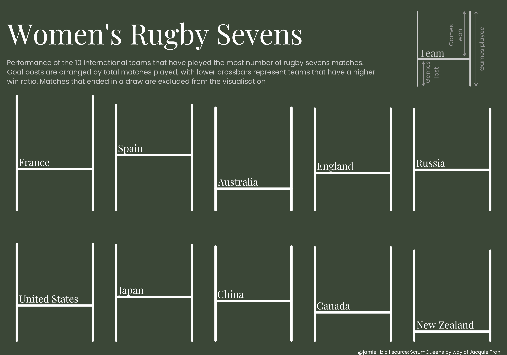

```{r setup, include=FALSE}

rm(list=ls())

# Chargement du package qui va nous permettre de récupérer les données diffusées dans le cadre de tidytuesday
library(tidytuesdayR)

#Autre package utilisés dans la suite du code 
library(dplyr)
library(ggplot2)
library(stringr)
library(tidyverse)
library(patchwork)

```

```{r analyse, echo=FALSE, include=FALSE}
# Pour charger le jeu de données qui nous intéresse, il suffit de mentionner la date de diffusion dans la fonction tt_load du package tidytuesdayR
#tuesdata <- tidytuesdayR::tt_load('2022-05-24')
load('Tuesdata_24_05_22.rdata')

# Afin d'effectuer un graphique sur les mêmes données que celui critiqué, nous ne gardons que la base de données du tournoi 'sevens'

sevens <- tuesdata$sevens


max_year<-as.integer(str_sub(max(sevens$date),1,4))
min_year<-as.integer(str_sub(min(sevens$date),1,4))
nb_year<-max_year-min_year
nb_tournament<-length(unique(sevens$tournament))

```

## Le Sujet

Le jeu de données étudié correspond aux matchs féminin de rugby à 7 (Women's Sevens) de `r min_year` à `r max_year`. Sur ces `r nb_year`années, `r nb_tournament` tournois ont été organisés mais tous les pays n'y étaient pas forcément représentés.


## Le graphique critiqué

.


### Critique du graphe

Cette visualisation produite à partir du jeu de données présenté précédemment a pour but de représenter le nombres de victoires et de défaites des 10 pays ayant effectué le plus de match de `r min_year` à `r max_year`. 

L'étude et la critique de ce graphique va se divisée en plusieurs parties sur la base du **Trifecta checkup**:

1. What is the QUESTION?
La visualisation ci-dessus répond à la question suivante : "qui a gagné **le plus** de match au tournoi de Rugby Sevens féminin -> NZ"
2. What does the DATA say?
3. What does the VISUAL say?


* élément visuel des poteaux utilisé pour représenter les matchs gagnés : mauvais outil, à portée graphique et suelle, n'apporte pas d'information et trouble même le lecteur car tous les poteaux ne font pas la même taille (cf. France et NZ)
* pas d'échelle 
* pas de résultat en exergue 
* la date du tournoi pour remettre l'évènement dans le temps
-> après analyse des données, on se rend compte que les matchs ont été recensés de 1997 à 2022 


### Points positifs : 
* Pas trop d'information (même pas assez)
* le message que la NZ est la nation ayant gagné le plus de match est passé mais le nombre de match joué inférieur à celui de la France par exemple, peut amener à tromper la lecture. 
* Le guide de lecture en haut à droite nous permet de mieux comprendre les explications écrites de comment lire les graphes. 
* les couleurs sont, à mon sens, bien utilisées rapelant le terrain de rugby (pas essentiel mais cela ne trouble pas la lecture)


### Trifecta
La question à laquelle répond cette représentation est : qui a gagné **le plus** de match au tournoi de Rugby Sevens féminin -> NZ. En revanche certaines questions restent sans réponses : 
* Combien de match la NZ a-t-elle gagné et sur combien ? 
* Pourquoi certains pays n'ont pas joué autant de match que les autres ? 
* Contre qui la NZ a-t-elle perdu ? 
* matchs nuls exclus 
* tous les poteaux n'étant pas sur la même ligne, il est difficile de comparer la ligne 1 avec la ligne 2 


## Le graphique refait

```{r réorganisation des données, echo=FALSE}
# on remarque qu'il y a des équipes Néo-zélandaises ayant fait des match sous un autre nom que "New Zealand', on les regroupent toutes sous le même nom 
sevens <- sevens %>%
  mutate(winner = case_when(str_detect(winner, "New Zealand") ~ "New Zealand",
                            TRUE ~ winner))

winners <- sevens %>%
  group_by(winner)%>%
  count(winner)%>%
  rename(team = winner,
         total_wins = n) %>%
  ungroup()

losers <- sevens %>%
  group_by(loser)%>%
  count(loser)%>%
  rename(team = loser,
         total_loss = n) %>%
  ungroup()
  

# Calculons le nombre de matchs joués par chaque équipe


winlos <- full_join(winners, losers, by = c("team"))

  
winlos<-winlos%>%
  mutate(total_games=total_wins+total_loss)%>%
  arrange(desc(total_games))%>%
  head(10)


percW<-winlos%>%
  mutate(PW=(total_wins*100)/total_games)%>%
  arrange(desc(PW))

```


```{r graphique refait, echo=FALSE}
# Créer une nouvelle variable indiquant si la valeur est la plus grande
percW <- percW %>%
  mutate(max_value = ifelse(PW == max(PW), TRUE, FALSE))
graphe <- percW %>%
  ggplot(aes(x = reorder(team, PW), y = PW,fill=total_games)) +
  geom_col() +
  geom_text(aes(label = paste0(round(PW,1), "%")), vjust = -1) +  # Ajouter les valeurs de PW au-dessus des barres
  geom_abline(slope = 0, intercept = 50, color = 'red',linetype = "dashed")+
  labs(title = "% de matchs gagnés par les 10 pays ayant effectué le plus de matchs.",
       subtitle = "Matchs comptabilisés de 1997 à 2022. Ordonnés par % croissants",
       x="Pays",
       y="% de victoires",
       fill = "Matchs joués")+
  scale_y_continuous(labels =scales::number_format(suffix=" %"),limits=c(0,100))+  # Ajouter le % sur l'axe des ordonnées
  #scale_fill_manual(values = c("FALSE" = "grey", "TRUE" = "blue"),guide = "none")+
  scale_fill_gradient(low = "grey", high = "black") +  # Utiliser une échelle de couleur gradient
  plot_annotation(caption = "@jamie_bio | source: ScrumQueens by way of Jacquie Tran")+
  theme_test()


graphe
```


### A ajouter : 
* Période sur laquelle est calculé les match
* grouper par année : 1997 à 2022 -> 25 ans // chercher comment faire


## Commentaires 

* Justifier le fait de retirer les chiffres brut au profit des proportions
* Demander ce qu'en pense le prof pour la couleur


