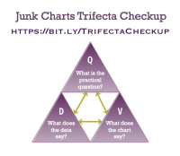

# Tidy Tuesday 📊

This repository contains my visualistaions and accompanying scripts for #TidyTuesday contributions. All of these contributions use only R packages (mainly those from the tidyverse such as dplyr and ggplot2).

Click the dropdown arrows to view contributions from different years.
-> how to make it ? 

# Sujets {.tabset}
## Tips to criticize

The Trifecta Checkup involves only three investigations: 

What is the QUESTION?
What does the DATA say?
What does the VISUAL say?

.
* Message: Is the main point of the visualization clear? Does the visualization effectively communicate the intended message?
* Visual: Are the design elements visually appealing and easy to understand? Do they enhance the viewer's understanding of the data?
* Data: Is the data accurate and relevant? Are any potential biases or limitations in the data addressed?

* draw the viewer's attention to the most important information.

[Trifecta Explained](https://junkcharts.typepad.com/junk_charts/junk-charts-trifecta-checkup-the-definitive-guide.html)

## Rugby 
Click here to view contribitions from 2022
-> rugby 
Commentaires sur le graphique : 
.

* élément visuel des poteaux utilisé pour représenter les matchs gagnés : mauvais outil, à portée graphique et suelle, n'apporte pas d'information et trouble même le lecteur car tous les poteaux ne font pas la même taille (cf. France et NZ)
* pas d'échelle 
* pas de résultat en exergue 
* la date du tournoi pour remettre l'évènement dans le temps
-> après analyse des données, on se rend compte que les matchs ont été recensés de 1997 à 2022 

### Points positifs : 
* Pas trop d'information (même pas assez)
* le message que la NZ est la nation ayant gagné le plus de match est passé mais le nombre de match joué inférieur à celui de la France par exemple, peut amener à tromper la lecture. 
* Le guide de lecture en haut à droite nous permet de mieux comprendre les explications écrites de comment lire les graphes. 
* les couleurs sont, à mon sens, bien utilisées rapelant le terrain de rugby (pas essentiel mais cela ne trouble pas la lecture)

####La question à laquelle répond cette représentation est : qui a gagné **le plus** de match au tournoi de Rugby Sevens féminin -> NZ. En revanche certaines questions restent sans réponses : 
* Combien de match la NZ a-t-elle gagné et sur combien ? 
* Pourquoi certains pays n'ont pas joué autant de match que les autres ? 
* Contre qui la NZ a-t-elle perdu ? 
* matchs nuls exclus 
* tous les poteaux n'étant pas sur la même ligne, il est difficile de comparer la ligne 1 avec la ligne 2 

### A ajouter : 
* Période sur laquelle est calculé les match
* grouper par année : 1997 à 2022 -> 25 ans // chercher comment faire

## ERASMUS 

-> erasmus
Click here to view contribitions from 2021

